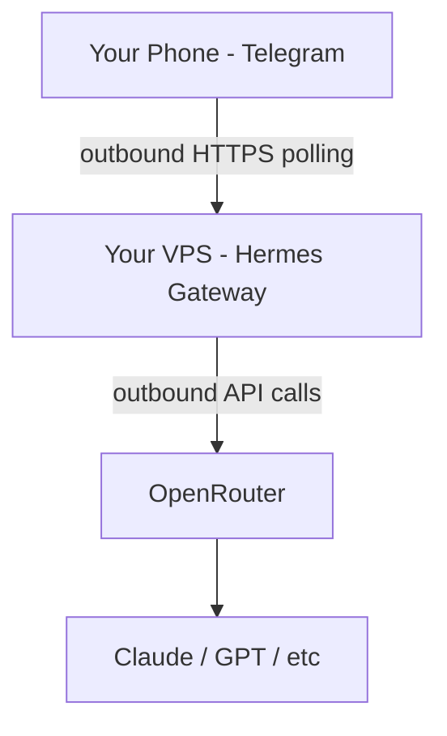

# Hermes Agent Deployment

Hermes Agent is a self-improving personal AI assistant by Nous Research. It connects to messaging platforms (Telegram, Discord, etc.) and learns from interactions via a closed learning loop.

## Architecture



Hermes gateway connects **outbound** to Telegram's API. No inbound port exposure needed.

## Prerequisites

1. **Bootstrap layer** must be run first (users, SSH, firewall)
2. **Infrastructure layer** with Tailscale (for SSH access to VPS)
3. **API keys** set in config (see Configuration below)

## Configuration

### Required Config Values

```bash
auberge config set hermes_openrouter_api_key <VALUE>
auberge config set hermes_telegram_bot_token <VALUE>
```

### Optional Config Values

```bash
auberge config set hermes_exa_api_key <VALUE>
auberge config set hermes_telegram_allowed_users <YOUR_TELEGRAM_USER_ID>
```

`hermes_telegram_allowed_users` restricts bot access to the specified Telegram user IDs (comma-separated). Without this, any Telegram user who knows the bot token can interact with it. Get your user ID by messaging @userinfobot on Telegram.

### Get API Keys

**OpenRouter:**

1. Sign up at https://openrouter.ai
2. Go to https://openrouter.ai/keys
3. Create API key and add credits

**Telegram Bot:**

1. Message @BotFather on Telegram
2. Send `/newbot` and follow prompts
3. Copy the bot token

**Exa (optional, free tier):**

1. Sign up at https://exa.ai
2. Go to dashboard → API keys
3. Copy API key (1,000 free searches/month)

## Deployment

```bash
auberge deploy hermes
```

Dependency layers (hardening, infrastructure) are resolved and run automatically.

### Check Mode (Dry Run)

```bash
auberge deploy hermes --check
```

## Post-Deployment Setup

### 1. Verify Service

```bash
ssh user@your-vps
systemctl --user status hermes-gateway
```

### 2. Test Telegram Bot

Send a message to your bot on Telegram. It should respond.

## Service Management

### Check Status

```bash
systemctl --user status hermes-gateway
```

### View Logs

```bash
journalctl --user -u hermes-gateway -f
```

### Restart Service

```bash
systemctl --user restart hermes-gateway
```

### Stop Service

```bash
systemctl --user stop hermes-gateway
```

## Daily Usage

Message your Telegram bot. Hermes:

- Remembers context across sessions (SQLite FTS5)
- Creates reusable skills from complex tasks
- Supports slash commands (`/new`, `/model`, `/compress`, `/skills`)
- Transcribes voice memos
- Searches the web (with Exa API key)

## Security

- **No public ports**: Gateway polls Telegram outbound only
- **Secrets**: Stored in `~/.hermes/.env` with mode `0600`
- **User allowlist**: Set `hermes_telegram_allowed_users` to restrict bot access to specific Telegram user IDs
- **Command approval**: Hermes prompts before running dangerous commands (133 patterns)
- **Prompt injection scanning**: Detects hidden content and Unicode tricks

## Troubleshooting

### Service Won't Start

```bash
journalctl --user -u hermes-gateway -n 50
```

Check for:

- Missing API keys (OpenRouter, Telegram)
- Python/uv not installed
- Network connectivity

### Bot Not Responding

```bash
journalctl --user -u hermes-gateway -f
```

Check for:

- Invalid Telegram bot token
- OpenRouter API key out of credits
- Rate limiting

## Updates

### Update via SSH

```bash
ssh user@your-vps
cd ~/.hermes/hermes-agent
git fetch && git checkout <new-tag>
VIRTUAL_ENV=~/.hermes/venv uv pip install -e ".[all]"
systemctl --user restart hermes-gateway
```

### Update via Ansible

```bash
auberge deploy hermes
```

## Removal

```bash
ssh user@your-vps
systemctl --user stop hermes-gateway
systemctl --user disable hermes-gateway
rm -rf ~/.hermes
rm -f ~/.local/bin/hermes
rm -f ~/.config/systemd/user/hermes-gateway.service
systemctl --user daemon-reload
```

## References

- [Hermes Agent Docs](https://hermes-agent.nousresearch.com/docs)
- [GitHub](https://github.com/NousResearch/hermes-agent)
- [OpenRouter](https://openrouter.ai)
- [Telegram BotFather](https://t.me/BotFather)
