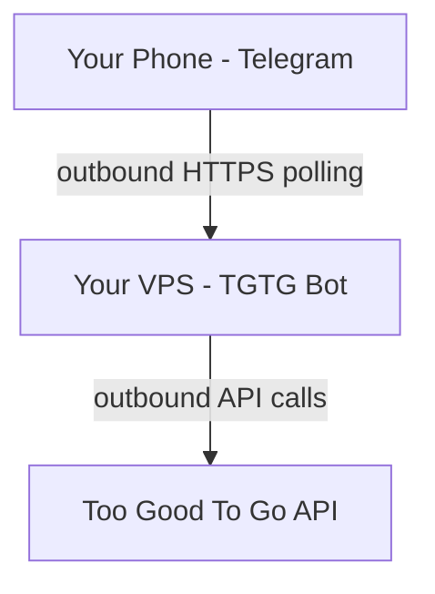

# TGTG Bot Deployment

TGTG Bot monitors Too Good To Go for available food bags and sends notifications via Telegram. It connects to the TGTG API and Telegram API outbound, requiring no inbound ports.

## Architecture



TGTG Bot connects **outbound** to both Telegram's API and the TGTG API. No inbound port exposure needed.

## Prerequisites

1. **Bootstrap layer** must be run first (users, SSH, firewall)
2. **Telegram bot token** configured (see Configuration below)

## Configuration

### Required Config Values

```bash
auberge config set tgtg_telegram_bot_token <VALUE>
```

### Get Telegram Bot Token

1. Message @BotFather on Telegram
2. Send `/newbot` and follow prompts
3. Copy the bot token

## Deployment

```bash
auberge deploy tgtg
```

Dependency layers (hardening, infrastructure) are resolved and run automatically.

### Check Mode (Dry Run)

```bash
auberge deploy tgtg --check
```

## Post-Deployment Setup

### 1. Verify Service

```bash
ssh user@your-vps
systemctl status tgtg
```

### 2. Log In to TGTG

Message your bot on Telegram and use `/login email@example.com` to start the TGTG login flow.

## Service Management

### Check Status

```bash
systemctl status tgtg
```

### View Logs

```bash
journalctl -u tgtg -f
```

### Restart Service

```bash
systemctl restart tgtg
```

### Stop Service

```bash
systemctl stop tgtg
```

## Daily Usage

Message your Telegram bot. Available commands:

- `/start` or `/help` - Welcome message
- `/login email@example.com` - Start TGTG login (sends PIN to email)
- `/pin 12345` - Complete login with PIN
- `/info` - Show currently available favorite bags
- `/settings` - Configure notification preferences

## Security

- **No public ports**: Bot polls Telegram and TGTG APIs outbound only
- **Dedicated system user**: Runs as `tgtg` user with nologin shell
- **Systemd hardening**: NoNewPrivileges, PrivateTmp, ProtectSystem=strict
- **Secrets**: Bot token stored in `config.ini` with mode `0600`

## Data

- **Persistent state**: `/var/lib/tgtg/` (login data, settings, item cache)
- **Source code**: `/opt/tgtg/`

## Troubleshooting

### Service Won't Start

```bash
journalctl -u tgtg -n 50
```

Check for:

- Missing Telegram bot token
- Python/dependencies not installed
- Network connectivity

### Bot Not Responding

```bash
journalctl -u tgtg -f
```

Check for:

- Invalid Telegram bot token
- TGTG API rate limiting
- Expired TGTG login session

## Updates

### Update via Ansible

```bash
auberge deploy tgtg
```

### Update via SSH

```bash
ssh user@your-vps
sudo -u tgtg git -C /opt/tgtg pull
sudo systemctl restart tgtg
```

## Removal

```bash
ssh user@your-vps
sudo systemctl stop tgtg
sudo systemctl disable tgtg
sudo rm -f /etc/systemd/system/tgtg.service
sudo systemctl daemon-reload
sudo userdel tgtg
sudo rm -rf /opt/tgtg /var/lib/tgtg
```

## References

- [GitHub](https://github.com/TorbenStriegel/TooGoodToGo-TelegramBot)
- [Too Good To Go](https://www.toogoodtogo.com)
- [Telegram BotFather](https://t.me/BotFather)
