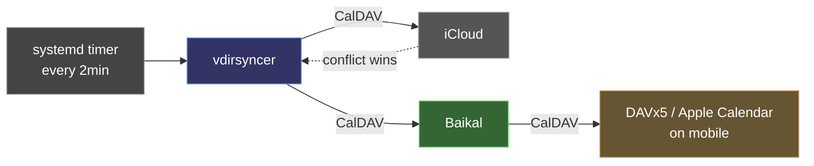

# vdirsyncer

Two-way iCloud-to-Baikal calendar synchronization via CalDAV.

Official Documentation: [https://github.com/pimutils/vdirsyncer](https://github.com/pimutils/vdirsyncer)

## When Do You Need This?

This is useful if you are a member of a shared iCloud calendar (with read/write access) and want to use it on Android. Adding an iCal URL in Google Calendar settings only gives read-only access. With vdirsyncer syncing to Baikal, you get full read/write access on Android via [DAVx5](https://www.davx5.com/).

## Prerequisites

- [Baikal](baikal.md) deployed and accessible
- A calendar created in the Baikal admin interface (`https://{BAIKAL_SUBDOMAIN}.{PRIMARY_DOMAIN}/admin/`)
- An iCloud app-specific password ([Apple instructions](https://support.apple.com/en-us/102654))
- Your iCloud CalDAV URL and calendar ID

<details>
<summary>How to retrieve your iCloud CalDAV URL</summary>

1. Log into the [iCloud Calendar web app](https://www.icloud.com/calendar/)
2. Open browser dev tools and inspect network requests
3. Filter requests by `collections`
4. The request URL has the form: `https://[serverId]-calendarws.icloud.com/ca/collections/[calendarId]?[...]&dsid=[userId]`
5. Your CalDAV URL is: `https://[serverId]-caldav.icloud.com/[userId]/calendars/[calendarId]`

The `serverId`, `userId`, and `calendarId` from step 4 map directly into the CalDAV URL in step 5.

</details>

## Configuration

```bash
auberge config set vdirsyncer_icloud_url <icloud-caldav-url>
auberge config set vdirsyncer_icloud_username <apple-id-email>
auberge config set vdirsyncer_icloud_password <app-specific-password>
auberge config set vdirsyncer_icloud_calendar_id <icloud-calendar-id>
auberge config set vdirsyncer_baikal_calendar_name <baikal-calendar-name>
```

The role is skipped entirely if `vdirsyncer_icloud_password` is not set, so vdirsyncer is opt-in by default.

## Deployment

```bash
auberge ansible run --tags vdirsyncer
```

## How It Works

A systemd timer triggers `vdirsyncer sync` every 2 minutes:



1. `vdirsyncer.timer` fires on schedule
2. `vdirsyncer.service` runs a one-shot sync
3. vdirsyncer pulls changes from iCloud CalDAV and pushes to Baikal (and vice versa)
4. On conflict, iCloud wins (`conflict_resolution = "a wins"`)
5. Mobile clients (DAVx5, Apple Calendar) sync directly with Baikal

Sync state is persisted in `/var/lib/vdirsyncer/status`.

## Monitoring

```bash
systemctl status vdirsyncer.timer
journalctl -u vdirsyncer.service -n 50
```

## Backup

Not included in the default backup set since vdirsyncer is opt-in. To back up explicitly:

```bash
auberge backup create --app vdirsyncer
```

This backs up `/var/lib/vdirsyncer` (sync state). Both `vdirsyncer.timer` and `vdirsyncer.service` are stopped during backup to prevent race conditions.

See [Backup & Restore](../../backup-restore/overview.md).

## Related

- [Baikal](baikal.md)
- [Environment Variables](../../configuration/environment-variables.md)
- [Backup & Restore](../../backup-restore/overview.md)
- [Applications Overview](../overview.md)
