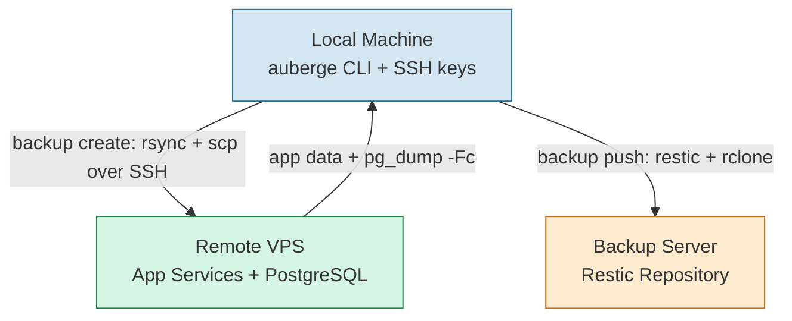

# Backup & Restore Overview

Auberge provides built-in backup and restore functionality for all self-hosted applications. Backups are stored locally and can be restored to the same host or migrated to a different host using the cross-host restore feature.

## Architecture



- **Local Machine**: Where `auberge` CLI is installed, holds SSH keys, stores backups in `~/.local/share/auberge/backups/`
- **Remote VPS**: Runs all apps deployed by `auberge`, source of backup data
- **Backup Server**: Offsite destination for encrypted restic snapshots (e.g. [Filen](https://filen.io) via rclone)

## Supported Applications

- **Baikal**: Calendar and contact data, configuration files
- **Bichon**: Email archives, search indices, configuration
- **FreshRSS**: SQLite database, configuration, user data
- **Navidrome**: Database and configuration (music files excluded by default)
- **Calibre**: Book library, metadata database, user database (login credentials)
- **WebDAV**: All shared files
- **Paperless-ngx**: Documents, media, PostgreSQL database (tags, correspondents, document types, users)
- **YOURLS**: URL shortener data and configuration

## Backup Storage

Backups are stored locally in `~/.local/share/auberge/backups/` with the following structure:

```
backups/
└── {hostname}/
    ├── baikal/
    │   ├── 2026-01-23_14-30-00/
    │   ├── 2026-01-23_18-45-12/
    │   └── latest -> 2026-01-23_18-45-12
    ├── freshrss/
    ├── navidrome/
    ├── calibre/
    └── webdav/
```

Each app has a `latest` symlink pointing to the most recent backup for easy access.

## Technical Details

### Backup Process

1. Services are stopped via `systemctl stop {service}`
2. For apps with databases (Paperless-ngx): `pg_dump -Fc` creates a compressed database dump on the remote host
3. Data is synced from remote using `rsync` with SSH
4. Database dumps are downloaded via `scp` and cleaned up on remote
5. Services are restarted via `systemctl start {service}`
6. `latest` symlink is updated to point to new backup

### Restore Process

1. Pre-flight validation (cross-host only)
2. Emergency backup creation (cross-host only)
3. User confirmation (hostname typing for cross-host, Y/N for same-host)
4. Services are stopped on target
5. Data is synced to remote using `rsync` with SSH
6. For apps with databases: dump is uploaded via `scp`, restored with `pg_restore --clean --if-exists`, then Django migrations are run
7. File ownership is set to service user (e.g., `chown -R calibre:calibre /home/calibre`)
8. Services are restarted on target
9. Post-restore guidance displayed (cross-host only)

### Offsite Backup

Local backups can be pushed to an offsite restic repository for disaster recovery. The workflow is:

1. Create a local backup with `auberge backup create`
2. Push it offsite with `auberge backup push`
3. Apply retention policies with `auberge backup prune` (7 daily, 4 weekly, 12 monthly)

For automated daily backups, use `auberge backup sync` which runs the full pipeline (create → push → prune → cleanup) in one command and removes local staging after a successful push. Prune failures are non-fatal. See [backup sync](../cli-reference/backup/sync.md).

For the full end-to-end setup guide (installing dependencies, configuring rclone, setting auberge config), see [backup push](../cli-reference/backup/push.md#setup).

### Excluded Files

The following patterns are excluded from backups to reduce size:

- `.git/` directories (except Baikal's VCS)
- `node_modules/`
- `venv/`, `__pycache__/`
- `*.pyc`, `*.pyo`, `*.tmp`, `*.log`
- `.DS_Store`, `.cache/`
- `.Baikal.cache/`

### SSH Connection Pooling

Backup and restore operations use SSH ControlMaster for connection reuse:

- ControlPath: `/tmp/ssh-%r@%h:%p`
- ControlPersist: 60 seconds

This significantly speeds up operations that require multiple SSH commands.

## Related Documentation

- [Creating Backups](creating-backups.md)
- [Listing Backups](listing-backups.md)
- [Restoring Backups](restoring-backups.md)
- [Cross-Host Migration](cross-host-migration.md)
- [OPML Management](opml-management.md)
- [Best Practices](best-practices.md)
- [CLI Reference: backup sync](../cli-reference/backup/sync.md)
- [CLI Reference: backup push](../cli-reference/backup/push.md)
- [CLI Reference: backup prune](../cli-reference/backup/prune.md)
