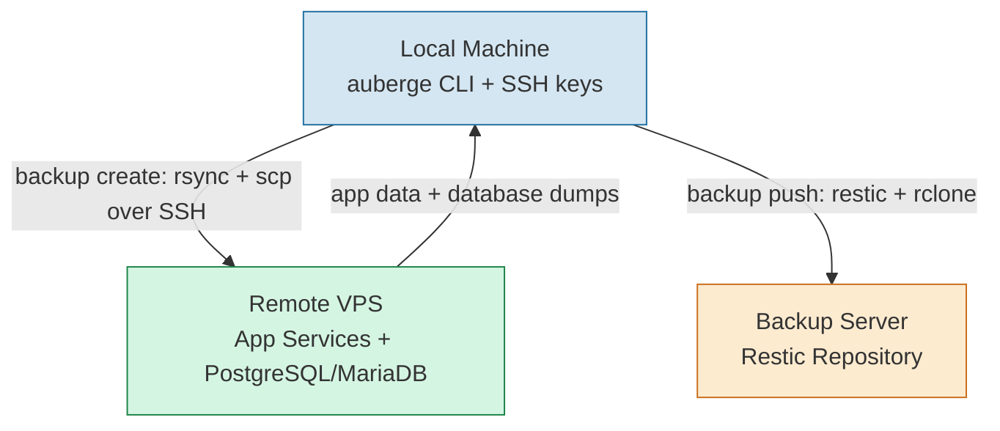

# Backup & Restore Overview

Auberge provides built-in backup and restore functionality for all self-hosted applications. Backups are stored locally and can be restored to the same host or migrated to a different host using the cross-host restore feature.

## Architecture


```mermaid
graph TD
    Local["Local Machine<br/>auberge CLI + SSH keys"]
    Remote["Remote VPS<br/>App Services + PostgreSQL/MariaDB"]
    Offsite["Backup Server<br/>Restic Repository"]

    Local -- "backup create: rsync + scp over SSH" --> Remote
    Remote -- "app data + database dumps" --> Local
    Local -- "backup push: restic + rclone" --> Offsite

    style Local fill:#d4e6f1,stroke:#2471a3
    style Remote fill:#d5f5e3,stroke:#1e8449
    style Offsite fill:#fdebd0,stroke:#ca6f1e
```

- **Local Machine**: Where `auberge` CLI is installed, holds SSH keys, stores backups in `~/.local/share/auberge/backups/`
- **Remote VPS**: Runs all apps deployed by `auberge`, source of backup data
- **Backup Server**: Offsite destination for encrypted restic snapshots (e.g. [Filen](https://filen.io) via rclone)

## Supported Applications

- **Actual Budget**: Server account database and budget blobs (clients keep full local copies)
- **Baikal**: Calendar and contact data, configuration files
- **Bichon**: Email archives, search indices, configuration
- **FreshRSS**: SQLite database, configuration, user data
- **Navidrome**: Database and configuration (music files only with `--include-music`; a backup that holds them restores them)
- **Calibre**: Book library, metadata database, user database (login credentials)
- **Gokapi**: SQLite database and uploaded shared files
- **Grimmory**: Book library files (`/srv/books`), app data (`/srv/grimmory`), and MariaDB metadata database
- **Paperless-ngx**: Documents, media, PostgreSQL database (tags, correspondents, document types, users)
- **YOURLS**: Installation files and MariaDB database (short links, click stats)

## Backup Storage

Backups are stored locally in `~/.local/share/auberge/backups/` with the following structure:

```
backups/
└── {hostname}/
    ├── 2026-01-23_14-30-00/
    │   ├── baikal/
    │   ├── freshrss/
    │   └── navidrome/
    └── 2026-01-23_18-45-12/
        ├── baikal/
        └── freshrss/
```

One directory per run, holding one directory per app backed up in that run. `auberge backup push` uploads a whole timestamped run, and `backup verify` reads the same `{hostname}/{timestamp}` layout back out of the repository.

## Technical Details

### Backup Process

1. For apps declaring `attests:`, the app is asked where its data actually lives and the answer is checked against the recipe's declared paths. A path the app reports that no declared path contains fails that app's backup before anything is stopped, as does an attestation that exits non-zero. Reporting nothing does not fail — every way of failing to ask exits non-zero, so an empty answer just means the app holds no data yet. Grimmory is the only such app today: its library root is a row in its own database, so the role's declaration is a note that can silently stop matching
2. Services are stopped via `systemctl stop {service}`
3. For apps with databases: a dump is created on the remote host — `pg_dump -Fc` for PostgreSQL (Paperless-ngx), `mariadb-dump --single-transaction` for MariaDB (Grimmory, YOURLS)
4. Data is synced from remote using `rsync` with SSH
5. Database dumps are downloaded via `scp` and cleaned up on remote
6. Services are restarted via `systemctl start {service}`

### Restore Process

1. Pre-flight validation (cross-host only)
2. Emergency backup creation (cross-host only)
3. User confirmation (hostname typing for cross-host, Y/N for same-host)
4. Services are stopped on target
5. Data is synced to remote using `rsync` with SSH — every path the backup holds, including optional ones like Navidrome's `/srv/music`
6. For apps with databases: dump is uploaded via `scp` and restored — `pg_restore --clean --if-exists` for PostgreSQL, piping the dump into `mariadb` for MariaDB — then any `post_restore_command` (e.g. Paperless-ngx's Django migrations) is run
7. File ownership is set to service user (e.g., `chown -R calibre:calibre /home/calibre`)
8. Services are restarted on target
9. Post-restore guidance displayed (cross-host only)

### Offsite Backup

Local backups can be pushed to an offsite restic repository for disaster recovery. The workflow is:

1. Create a local backup with `auberge backup create`
2. Push it offsite with `auberge backup push`
3. Apply retention policies with `auberge backup prune` (7 daily, 4 weekly, 12 monthly)
4. Confirm it landed with `auberge backup verify` — the only step that reads the repository back. See [backup verify](cli-reference/backup/verify.md)

For automated daily backups, use `auberge backup sync` which runs the full pipeline (create → push → prune → cleanup) in one command and removes local staging after a successful push. Prune failures are non-fatal. See [backup sync](cli-reference/backup/sync.md).

For the full end-to-end setup guide (installing dependencies, configuring rclone, setting auberge config), see [backup push](cli-reference/backup/push.md#setup).

### Excluded Files

The following patterns are excluded from backups to reduce size:

- `.git/` directories (except Baikal's VCS)
- `node_modules/`
- `venv/`, `__pycache__/`
- `*.pyc`, `*.pyo`, `*.tmp`, `*.log`
- `.DS_Store`, `.cache/`
- `.Baikal.cache/`

### SSH Connection Pooling

Backup and restore operations use SSH ControlMaster for connection reuse:

- ControlPath: `/tmp/ssh-%r@%h:%p`
- ControlPersist: 60 seconds

This significantly speeds up operations that require multiple SSH commands.
